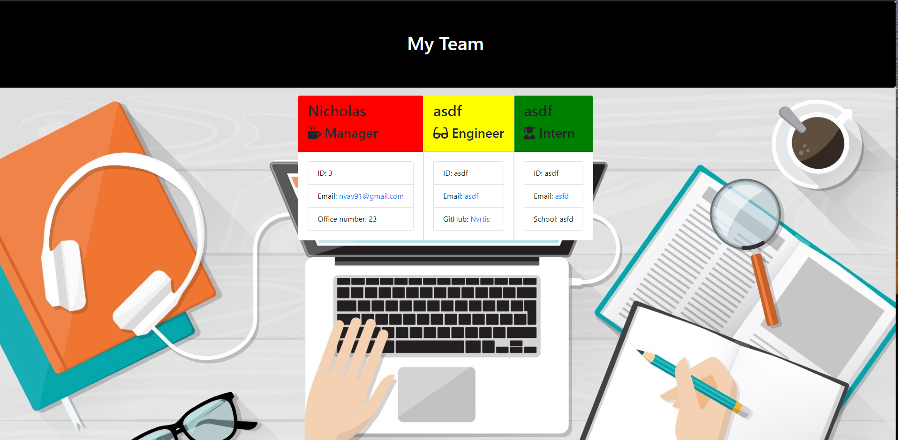

# Template engine  
  
  
  
  
  
  
  

  

  [Link to webpage](https://github.com/Nvrtis/template-engine)
  
  As a manager I want to generate a webpage that displays my team's basic info so that I have quick access to emails and GitHub profiles  
    
  ## Table of Content
  [-Installation](#Installation)  
  [-Description](#Description)    
  [-Usage](#Usage)  
  [-Contributors](#Contributors)  
  [-Test](#Test)  
  [-Questions](#Questions)  
  
  
  ## Installation  
  Download project and make sure user has node.js. After running npm init and npm install which will download jest and inquirer in the node modules. then the user is ready to use the project.

  ## Description  
  This project is divided in several folders. The lib folder contains the class syntex for all the employees the users wants to input and how to render the users team into the html. template is where the users team is added into html format. test folder is for testing the class syntex and output folder is where the users finished html will be published.

  ## Usage  
  This project are meant for managers that wants to have their teams information in a simple format, where they can see their contact information. The project starts in the terminal with "node app"
  
  [Link to youtube video ](https://youtu.be/zLUmR0GsZrI)
  
  ## Test  
  With jest and testing class syntex
  
  ## Questions?  
  
    My Github link is [Nvrtis](https://github.com/Nvrtis)
    Any futher questions can be sent to my email here  <Nvav91@gmail.com>
